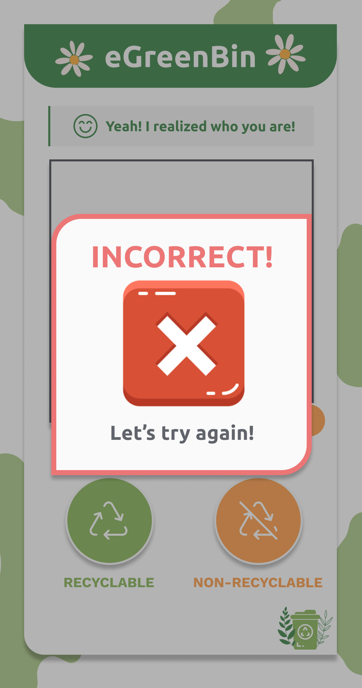
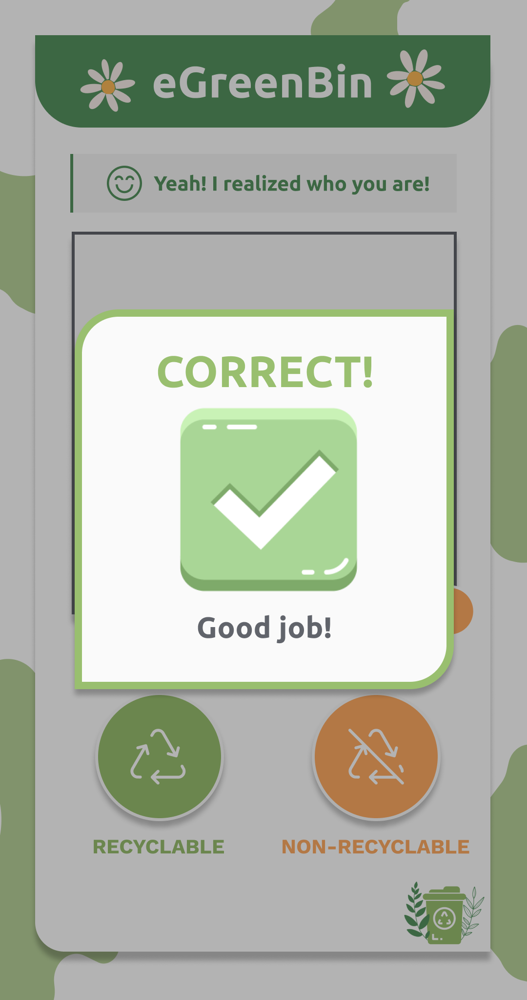

# eGreenBin interact

This Flutter project is a face recognition app. It is designed to detect the face of a student and retrieve their name from a database. Students can interact with the IoT system through picking Recycled/Non-recycled for that piece of trash.

## Getting Started

To get started with this project, follow these steps:

1. Clone the repository
2. Open the project in your preferred IDE (e.g. Android Studio, VS Code)
3. Run `flutter pub get` to install the required dependencies
4. Run the project in an emulator or on a physical device

## Using The App

The app has a simple user interface that allows you to choose between two options - recycled or non-recycled. 

## Project Structure

The project consists of the following files and directories:

- `android/` : The Android-specific project files
- `ios/`: The iOS-specific project files
- `lib/`: The Dart code for the app
- `pubspec.yaml`: The pubspec file for the app

## Dependencies

The app uses the following dependencies:

- `cupertino_icons:` ^1.0.2
- `get:`^4.6.5
- `camera:`^0.10.3
- `image:` ^3.2.0
- `path_provider:` ^2.0.12
- `google_mlkit_face_detection:` ^0.4.0
- `audioplayers:` ^3.0.1
- `confetti:` ^0.7.0
- `lottie:` ^2.2.0
- `http:` ^0.13.5
- `web_socket_channel:` ^2.3.0
- `flutter_launcher_icons:` "^0.11.0”

## Demo

  
  
  
  

## Future improvements

- Improve user experience better
- Face processing speed will be faster
